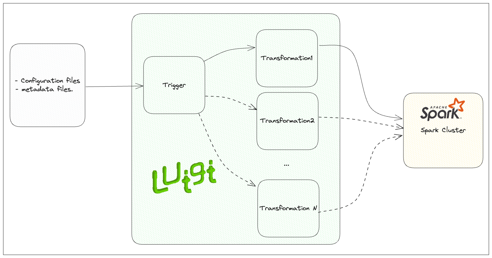

# Metadata Ingestion Engine with Spark

## Overview

This project is a metadata ingestion engine developed using Apache Spark. It enables efficient processing of large-scale metadata from various sources and formats, providing insights and actionable data for downstream applications.

## Getting Started

### Solution overview


### Prerequisites

- Apache Spark (version 3.5.1)
- Python (version 3.9.2)
- All packages included in `requirements-dev.txt`. For example, `pip install -r requirements-dev.txt`.

### Installation

In the following repository you could find an easy to handle way to run Spark, `https://github.com/jesonora/spark-infra`.

### Data Structure
└── data
    ├── output
    │   ├── events
    │   │   └── person
    │   │       ├── (Output files related to specific person's events)
    │   ├── discards
    │   │   └── person
    │   │       ├── (Discarded items related to specific person)
    ├── input
    │   ├── events
    │   │   └── person
    │   │       ├── (Input files related to specific person's events)
    ├── logs
    │   ├── (Pipeline's log files)

### Usage

1. Setup repository
2. Setup mock data running `sh mock_data/create_data.sh`, it will create the data structure and add some mock data.
3. Configure the `config/config_dev.yml` file, adding more transformations, or inputs/outputs.
4. In a terminal execute
   ```shell
   export PYTHONPATH="${PYTHONPATH}:$(pwd)"
   python3 -m luigi --module main TriggerPipeline --local-scheduler
   ```
